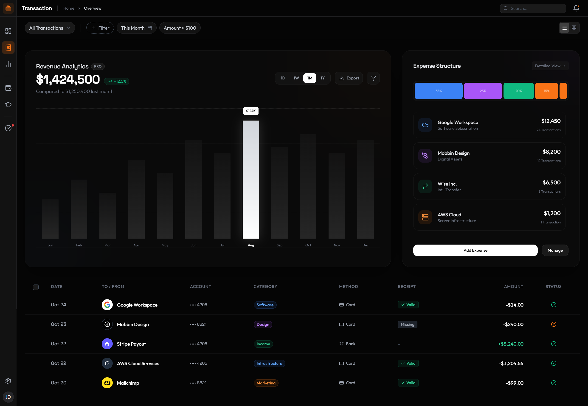

# Finora

> A premium, futuristic fintech dashboard built with a "Linear-esque" design philosophy. Dark mode, data-dense, and built for performance.



## ✨ Features

- **Premium Dark Mode UI** - Deep dark theme (`#0A0A0A`) with glassmorphism effects
- **Financial Analytics** - Revenue charts, transaction monitoring, and cash flow visualization
- **Component-Based Architecture** - Modular HTML components with a custom include system
- **Modern Tech Stack** - Built with Bun, TailwindCSS, and TypeScript
- **Custom Build System** - Fast, efficient build pipeline with HTML includes
- **Responsive Design** - Desktop-first with mobile adaptations
- **Lucide Icons** - Beautiful, consistent iconography throughout

## 🚀 Quick Start

### Prerequisites

- [Bun](https://bun.sh) v1.0 or higher

### Installation

```bash
# Clone the repository
git clone https://github.com/0xmilon/finora-fintech-dashboard.git
cd finora-fintech-dashboard

# Install dependencies
bun install

# Build the project
bun run build

# Development mode with watch
bun run dev
```

### Project Structure

```
finora/
├── build.ts             # Custom Build Logic
├── tailwind.config.js   # Design Tokens
├── src/
│   ├── index.ts         # Entry Point (Lucide initialization)
│   ├── styles/
│   │   └── input.css    # Tailwind Directives
│   ├── pages/
│   │   └── index.html   # Main Layout Skeleton
│   └── components/      # Reusable HTML Blocks
│       ├── sidebar.html
│       ├── header.html
│       ├── analytics.html
│       ├── filter-bar.html
│       └── transaction-table.html
└── dist/                # Build Output
```

## 🎨 Design Philosophy

Finora follows a **"Linear-esque"** design approach:

- **Dark Mode First** - Strictly dark mode with `bg-[#0A0A0A]` backgrounds
- **Glassmorphism** - Subtle borders (`border-white/5`) and transparent surfaces
- **Data Density** - High information density balanced with readability
- **Premium Aesthetics** - Think "Apple" × "Linear" - not generic admin panels
- **Micro-Interactions** - Smooth transitions (`transition-all duration-300`)

### Design Tokens

- **Background**: `#050505` (background), `#0A0A0A` (cards)
- **Surface Colors**: `surface-50` through `surface-300` for layered elements
- **Primary**: `#F97316` (orange accent)
- **Borders**: `border-white/5` or `border-white/10` for subtle separation

## 🛠️ Development

### Building

The project uses a custom TypeScript build script that:

1. Processes HTML includes (`<!-- include: "component-name" -->`)
2. Compiles TailwindCSS
3. Bundles TypeScript

```bash
bun build.ts
```

### Component System

Components are located in `src/components/` and included in pages using:

```html
<!-- include: "component-name" -->
```

The build system automatically resolves and injects component content.

### Adding Components

1. Create a new HTML file in `src/components/`
2. Use kebab-case naming: `my-component.html`
3. Include it in pages: `<!-- include: "my-component" -->`

### Styling Guidelines

- Use TailwindCSS utility classes
- Follow the design tokens in `tailwind.config.js`
- Cards: `rounded-3xl border border-white/5 bg-[#0A0A0A]`
- Buttons: Primary (`bg-white text-black`) or Secondary (`bg-surface-100`)
- Numbers: Use `tabular-nums` for currency/numbers

## 📦 Tech Stack

- **Runtime**: [Bun](https://bun.sh) - Fast JavaScript runtime
- **Styling**: [TailwindCSS](https://tailwindcss.com) v3.4+ - Utility-first CSS
- **Icons**: [Lucide Icons](https://lucide.dev) - Beautiful icon library
- **TypeScript** - Type safety and modern JavaScript features

## 🎯 Roadmap

- [ ] Add more dashboard views (Cash Flow, Reports)
- [ ] Implement data persistence
- [ ] Add chart interactivity
- [ ] Mobile optimizations
- [ ] Theme customization options
- [ ] Component library documentation

## 🤝 Contributing

Contributions are welcome! Please feel free to submit a Pull Request.

1. Fork the repository
2. Create your feature branch (`git checkout -b feature/AmazingFeature`)
3. Commit your changes (`git commit -m 'Add some AmazingFeature'`)
4. Push to the branch (`git push origin feature/AmazingFeature`)
5. Open a Pull Request

### Code Style

- Follow the existing code structure
- Use kebab-case for file names
- Maintain the dark mode aesthetic
- Add hover states to all interactive elements
- Ensure mobile responsiveness

## 📝 License

This project is licensed under the MIT License - see the [LICENSE](LICENSE) file for details.

## 🙏 Acknowledgments

- Design inspiration from [Linear](https://linear.app)
- Icons by [Lucide](https://lucide.dev)
- Built with [Bun](https://bun.sh)

## 📧 Contact

For questions, suggestions, or support, please open an issue on GitHub.

---

**Built with ❤️ for the fintech community**

